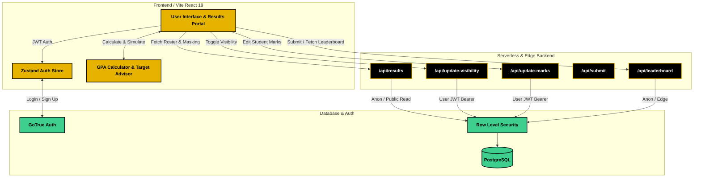
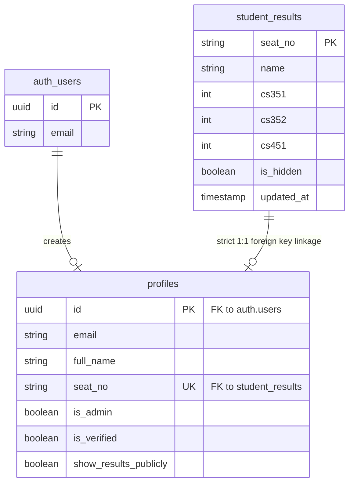

<div align="center">
  
  
  
  
  
  

  <h1 align="center">🟡 UBIT GPA Calculator & Results Hub (Batch '28) ⚫</h1>
  
  <p align="center">
    <strong>A high-performance, mobile-first academic portal designed specifically for the students of the Department of Computer Science (UBIT), University of Karachi.</strong>
  </p>

  <p align="center">
    <a href="https://ubit-results-28.vercel.app/"><b>Live Portal</b></a> •
    <a href="#-system-architecture"><b>Architecture</b></a> •
    <a href="#-database--security"><b>Security & Privacy</b></a> •
    <a href="#-deployment--database-setup"><b>Setup Guide</b></a>
  </p>
</div>

---

## ⚡ Overview
Built with a bold **"Neo-Brutalist"** design system (striking high-contrast yellow `#FFD700`, crisp black borders, and tactile drop-shadows), this platform empowers DCS UBIT BSCS (Batch 2024–28) students to calculate semester GPAs, track cumulative CGPAs, explore the official class roster, simulate future targets, and maintain complete control over their grade privacy.

## ✨ Core Features
- 📋 **Live Results Portal**: Browse, search, and inspect the official batch results across Semesters 1, 2, and 3 with instant filtering by seat number, student name, or course.
- 🔒 **Student Privacy Controls**: Students can toggle their marks visibility in their profile. When set to Private, all subject marks are strictly masked as `🔒 Hidden` on the public directory while retaining their name in the batch roster.
- 🧮 **Official Grading Precision**: Exact implementation of the University of Karachi 4.0 grading formula with zero rounding errors, handling partial semesters and unannounced marks gracefully.
- 🎯 **Target CGPA Advisor**: Smart simulator that analyzes past semester GPAs and calculates the exact required semester performance to hit graduation goals.
- 🔐 **Role-Based Authentication**: Secure Supabase GoTrue authentication with strict seat-number deduplication. Students can only edit or view private data for their verified seat number.
- 📄 **PDF Grade Report Generation**: Generate clean, print-ready academic transcripts on demand.
- 📌 **Persistent Desktop Header**: Fixed, blur-backed navigation that stays accessible anywhere across long tables and view transitions.
- 📱 **Mobile-First & Ultra-Fast**: Instant 0ms startup without artificial splash screens, fluid table scrolling, and full responsiveness across all screen sizes.

---

## 🏗️ System Architecture



---

## 🛡️ Database & Security

The system employs PostgreSQL data integrity constraints and Row-Level Security (RLS) policies to guarantee student privacy and data accuracy.



### Security & Privacy Highlights
- **Strict Foreign Key Linking**: `profiles.seat_no` is constrained by a `FOREIGN KEY` to `student_results.seat_no`, preventing registration with arbitrary or invalid seat numbers.
- **Deduplication**: `seat_no` is strictly `UNIQUE` in the `profiles` table. Each student seat number can only be claimed once.
- **Privacy-First Mark Redaction**: When a student sets their account to **Hidden (Private)**, marks in the public results directory are masked across all columns. Full scores remain accessible exclusively to the verified student owner in their profile.
- **Row-Level Security (RLS)**: Only verified students matching their assigned `seat_no` (or administrators) can execute updates on records.

---

## 💻 Tech Stack
- **Frontend**: React 19, TypeScript, Vite, Zustand
- **Backend & Database**: Supabase (PostgreSQL 15, GoTrue Auth, Row-Level Security)
- **API Runtime**: Vercel Edge & Serverless Functions
- **Styling**: Tailwind CSS (Custom Neo-Brutalist Theme)
- **Animations & Visuals**: Framer Motion, Canvas Confetti, Lucide Icons
- **Document Export**: html2canvas, jsPDF

---

## 🚀 Deployment & Database Setup

This project is configured for automated deployment on Vercel.

### 1. Environment Variables
Add the following keys in your Vercel project settings:
```env
VITE_SUPABASE_URL=https://your-project.supabase.co
VITE_SUPABASE_ANON_KEY=your-supabase-anon-key
SUPABASE_SERVICE_ROLE_KEY=your-optional-service-role-key
```

### 2. Database Schema Initialization
Execute the SQL files located in the `supabase/` directory in your Supabase SQL Editor:
1. `supabase/schema.sql`: Creates `profiles`, links to `student_results`, and sets up initial RLS policies.
2. `supabase/privacy-migration.sql`: Applies the student privacy control columns and public visibility rules.
3. `supabase/migrate-sem3.sql`: Adds columns for Semester 3 courses (`cs451` through `cs461`).

### 3. Build & Run Locally
```bash
# Install dependencies
npm install

# Start local Vite dev server
npm run dev

# Dump latest production database snapshot to local fallback
npm run db:dump

# Build for production
npm run build
```

---

<div align="center">
  <i>Developed for the students of <b>Department of Computer Science (UBIT), University of Karachi</b> • Batch '28</i>
</div>
