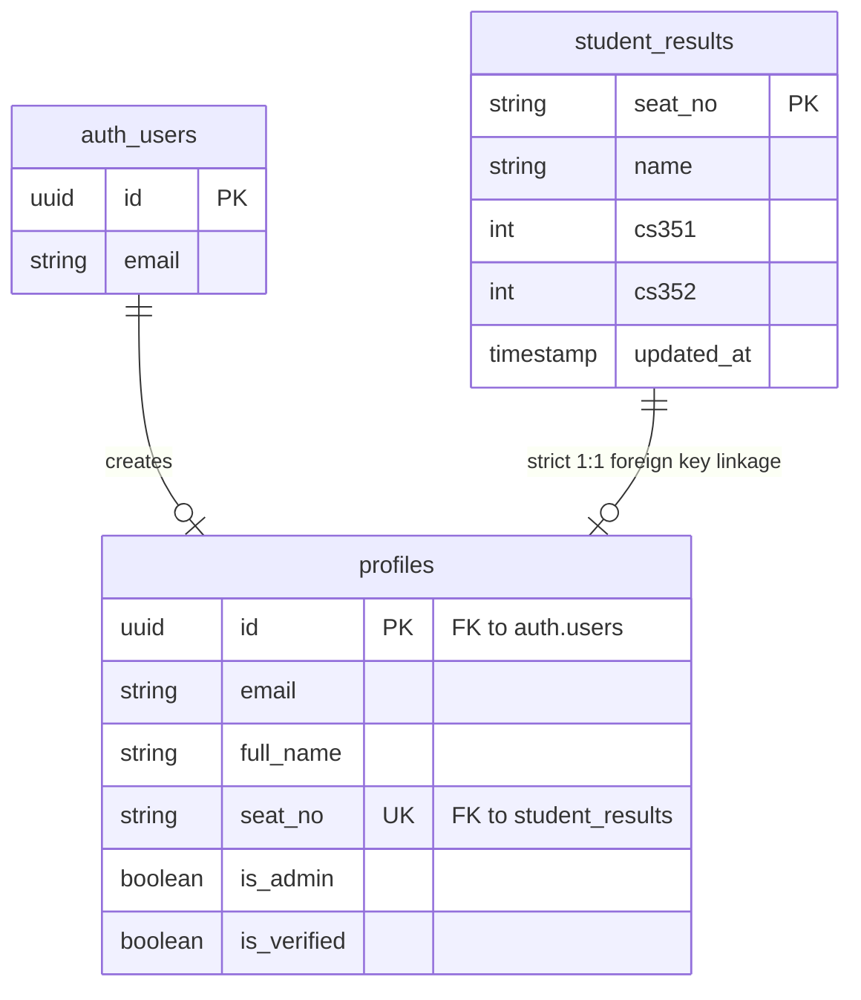

<div align="center">
  
  
  
  
  

  <h1 align="center">🟡 UBIT GPA Calculator (Batch '28) ⚫</h1>
  
  <p align="center">
    <strong>A high-performance, mobile-first web application designed specifically for the students of the Department of Computer Science (UBIT), University of Karachi.</strong>
  </p>

  <p align="center">
    <a href="https://ubit-gpa-calculator-28.vercel.app/"><b>Live Demo</b></a> •
    <a href="#-system-architecture"><b>Architecture</b></a> •
    <a href="#-database--security"><b>Security</b></a> •
    <a href="#-deployment-instructions"><b>Deploy</b></a>
  </p>
</div>

---

## ⚡ Overview
Built with a premium **"Liquid Neo-Brutalist"** aesthetic (characterized by sharp shadows, bold black borders, and stark yellow accents), this tool allows DCS UBIT students to calculate semester GPAs, track cumulative CGPAs, and securely manage their official grades.

## ✨ Core Features
- 🔐 **Secure Role-Based Authentication**: Full JWT auth. Users must verify their exact seat numbers, preventing duplicate claims. Admins possess deep-access dashboard controls.
- 🧮 **Accurate Grading Logic**: Flawlessly implements the official UOK grading scale (e.g., 50-52 = 1.0, <50 = fail) with zero truncation errors.
- 📊 **Advanced Analytics & Insights**: Visualizes performance with responsive `Recharts` and computes real-time dynamic batch percentiles.
- 🏆 **Global Leaderboard**: Secure, real-time leaderboard powered by Supabase and Vercel Edge functions.
- 📸 **Serverless "Wrapped" Snapshot**: Generate beautiful, exportable PNG snapshots of academic performance using Vercel `@vercel/og` image generation.
- 📱 **Mobile-First Design**: Optimized for compact, stutter-free performance on mobile browsers with a deeply polished UI and micro-animations.

---

## 🏗️ System Architecture

```mermaid
graph TD
    %% Styling
    classDef frontend fill:#E6B400,stroke:#000,stroke-width:2px,color:#000,font-weight:bold
    classDef edge fill:#000,stroke:#E6B400,stroke-width:2px,color:#fff,font-weight:bold
    classDef db fill:#3ECF8E,stroke:#000,stroke-width:2px,color:#000,font-weight:bold
    
    subgraph Client [Frontend / Vite React]
        UI[User Interface]
        AuthStore[Zustand Auth Store]
        Calc[GPA Calculator]
    end

    subgraph Vercel [Serverless Backend]
        API_Submit[/api/submit]
        API_Leader[/api/leaderboard]
        API_Update[/api/update-marks]
    end

    subgraph Supabase [Database & Auth]
        Auth[GoTrue Auth]
        RLS[Row Level Security]
        DB[(PostgreSQL)]
    end

    UI -->|JWT Auth| AuthStore
    AuthStore <-->|Login / Sign Up| Auth
    UI <-->|View & Calculate| Calc
    
    UI -->|Submit Score| API_Submit
    UI -->|Fetch Ranks| API_Leader
    UI -->|Edit Marks| API_Update
    
    API_Submit -->|Anon Key| RLS
    API_Leader -->|Anon Key| RLS
    API_Update -->|User JWT Bearer| RLS
    
    RLS --> DB

    class UI,AuthStore,Calc frontend
    class API_Submit,API_Leader,API_Update edge
    class Auth,RLS,DB db
```

---

## 🛡️ Database & Security

The system employs strict PostgreSQL data integrity and Row-Level Security (RLS) to ensure users can only modify data they legally own.



### Security Highlights
- **Strict Foreign Key Linking**: The `profiles.seat_no` column has a strict `FOREIGN KEY` mapped to `student_results.seat_no`. It is physically impossible to sign up with a fake seat number.
- **No Duplicates**: `seat_no` is strictly `UNIQUE` in the `profiles` table. A seat number can only be claimed once.
- **Row-Level Security (RLS)**: Even if the API endpoints are bypassed, the database itself denies `UPDATE` queries on `student_results` unless `auth.uid()` matches the verified owner of the row (or an admin).

---

## 💻 Tech Stack
- **Frontend**: React 19, TypeScript, Vite, Zustand
- **Backend**: Supabase (PostgreSQL, GoTrue Auth)
- **API**: Vercel Edge Functions
- **Styling**: Tailwind CSS (Custom Brutalist Theme)
- **Animations & Graphics**: Framer Motion, Recharts, `@vercel/og`

---

## 🚀 Deployment Instructions

This project is tailored for instant deployment on Vercel.

1. Connect this repository to your Vercel account.
2. Under **Environment Variables**, add the following keys (critical for Edge Functions):
   - `VITE_SUPABASE_URL` = Your Supabase project URL
   - `VITE_SUPABASE_ANON_KEY` = Your Supabase anon key
3. Ensure the Build Command is `npm run build` and Output Directory is `dist`.
4. Deploy!

### Database Setup
To initialize the backend, execute the provided `supabase-setup.sql` in your Supabase SQL Editor. This will generate the necessary tables, apply RLS policies, and establish the strict Foreign Key constraints between profiles and results.

---

<div align="center">
  <i>Developed by <b>AI + Asad</b> (Batch '28)</i>
</div>
