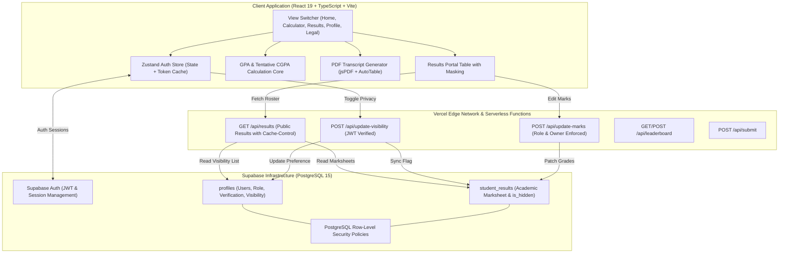

# 🏗️ System Architecture & Engineering

This document outlines the architecture, data flow, component hierarchy, and design decisions powering the **UBIT GPA Calculator & Results Hub**.

---

## 1. High-Level Topology

---

## 2. Frontend Architecture

### State Management (`Zustand`)
- **`useAuthStore`** manages authentication state, Supabase session tokens, user profile metadata, and verification statuses.
- Local reactive cache ensures instantaneous transitions between tabs without re-authenticating on every click.

### Layout System
- **Fixed Persistent Header**: Styled with neo-brutalist borders (`border-b-2 border-black`) and modern glassmorphism (`bg-white/95 backdrop-blur-md`). Fixed at `z-50` with page padding offset (`pt-16 sm:pt-20`) to eliminate scroll jump.
- **Micro-Animations**: Uses `framer-motion` for fluid tab transitions, modal overlays, and staggered table row appearances.

### Calculation Engine (`src/lib/utils.ts`)
- Strict implementation of the official University of Karachi DCS 4.0 grading scale.
- Honors credit hours (3.0 vs 2.0 vs 1.0) with quality point sums:
  $$\text{SGPA} = \frac{\sum (\text{GradePoint} \times \text{CreditHours})}{\sum \text{CreditHours}}$$
- Gracefully handles:
  - Unannounced / empty courses (`Results Unannounced`)
  - Partial semester progress without mathematical bias
  - 3-decimal precision formatting for official cumulative tracking.

---

## 3. Serverless Edge API Layer

All API functions reside in `/api` and execute on Vercel's edge network:

| Endpoint | Method | Auth Required | Purpose |
|---|---|---|---|
| `/api/results` | `GET` | No | Fetches batch records, merges privacy status, applies caching |
| `/api/update-visibility` | `POST` | Yes (Bearer JWT) | Updates student privacy preference in `profiles` and `student_results` |
| `/api/update-marks` | `POST` | Yes (Bearer JWT) | Updates course marks for verified student owner or admin |
| `/api/leaderboard` | `GET` / `POST` | Public / Token | Ranks submitted GPAs and percentiles across the batch |
| `/api/submit` | `POST` | Optional | Submits student GPA for leaderboard placement |

---

## 4. Offline & Fallback Resiliency

1. The frontend first attempts to fetch live data from `/api/results`.
2. If live network or database connectivity is unavailable, the portal seamlessly falls back to `/fallback-results.json` generated by `npm run db:dump`.
3. Hidden seat numbers are cached in `localStorage` to prevent unmasked grade flashes during initial page loads.
