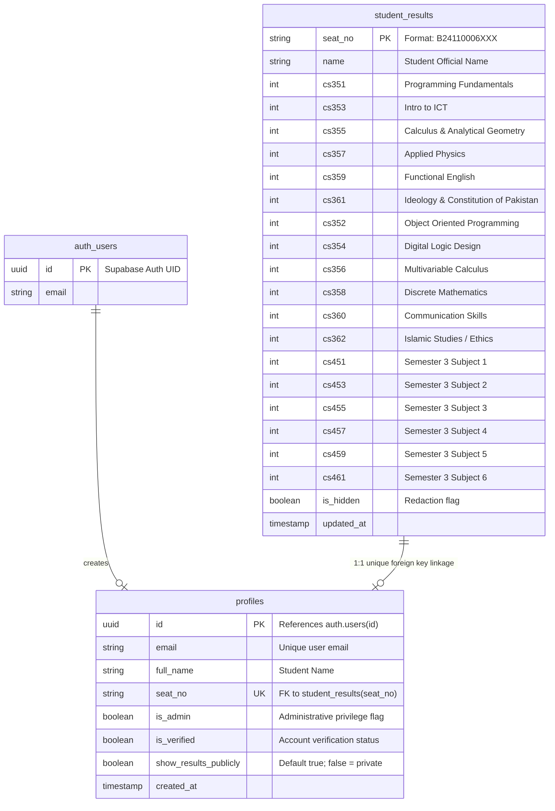

# 🗄️ Database Architecture & Security Policies

The backend utilizes **Supabase (PostgreSQL 15)** with Row-Level Security (RLS) and relational constraints to guarantee zero data tampering.

---

## 1. Relational Schema

---

## 2. Row-Level Security (RLS) Specifications

### `profiles` Table
| Policy Name | Action | Scope | Condition |
|---|---|---|---|
| `Public can view visibility settings` | `SELECT` | Public / Anon | `true` (Allows reading `seat_no` and `show_results_publicly` for directory masking) |
| `Users can read own profile` | `SELECT` | Authenticated | `auth.uid() = id` |
| `Admin can read all profiles` | `SELECT` | Authenticated | `is_admin()` |
| `Users can update own profile` | `UPDATE` | Authenticated | `auth.uid() = id` |
| `Admin can update all profiles` | `UPDATE` | Authenticated | `is_admin()` |

### `student_results` Table
| Policy Name | Action | Scope | Condition |
|---|---|---|---|
| `Allow public read-only access` | `SELECT` | Public / Anon | `true` |
| `Auth can update own results` | `UPDATE` | Authenticated | `EXISTS (SELECT 1 FROM profiles WHERE profiles.id = auth.uid() AND (profiles.is_admin = true OR (profiles.is_verified = true AND profiles.seat_no = student_results.seat_no)))` |

---

## 3. SQL Migrations Reference

All executable migration scripts reside in [`supabase/`](file:///c:/Users/Asad/Desktop/ubit-gpa-calculator/supabase):

1. **`supabase/schema.sql`**: Full baseline table schema, foreign keys, helper functions (`is_admin()`), and security policies.
2. **`supabase/privacy-migration.sql`**: Ensures `is_hidden` column exists on `student_results`, applies the public visibility select policy on `profiles`, and syncs private accounts.
3. **`supabase/migrate-sem3.sql`**: Adds columns `cs451` through `cs461` for Semester 3 courses.
